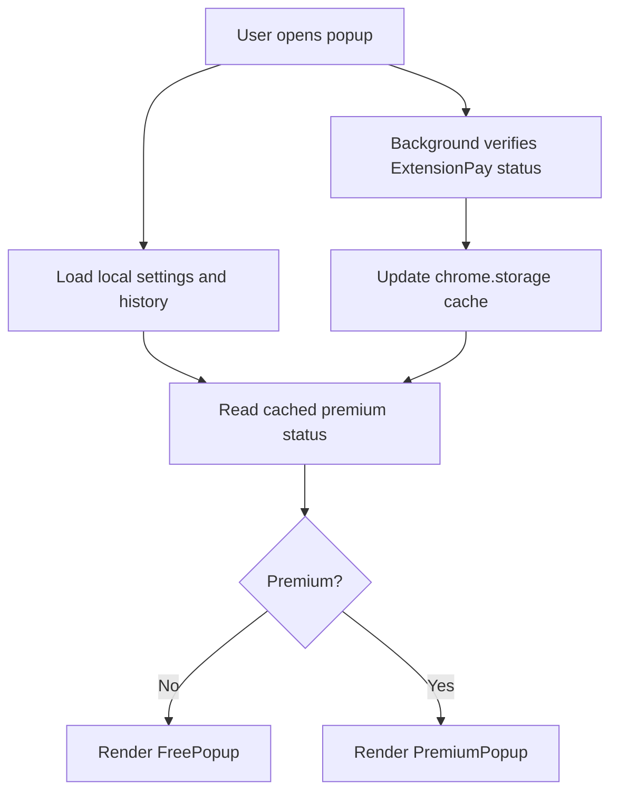
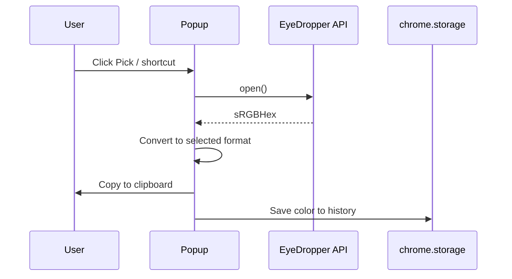

# PickPerfect Technical Guide

> Project specification, architecture notes, release criteria, and product positioning for the PickPerfect Chrome extension.

## Table of Contents

- [Product Summary](#product-summary)
- [Positioning](#positioning)
- [Feature Matrix](#feature-matrix)
- [Technical Stack](#technical-stack)
- [Architecture](#architecture)
- [Premium Flow](#premium-flow)
- [Permissions Model](#permissions-model)
- [Known Browser Quirks](#known-browser-quirks)
- [Quality Standards](#quality-standards)
- [Release Readiness](#release-readiness)
- [Launch Plan](#launch-plan)
- [Success Metrics](#success-metrics)

---

## Product Summary

PickPerfect is a Chrome Manifest V3 color picker built for developers and designers who want a fast, trustworthy way to pick colors and copy them into production workflows.

The core product uses Chrome's native `EyeDropper` API to pick from the full screen. That keeps the default picking flow free from page injection, DOM mutation, framework interference, and broad host permissions.

Project video: https://youtu.be/17t8El4sDEI

## Positioning

### Core Promise

> Pick colors from anywhere on your screen without letting a color picker interfere with your app.

### Competitive Context

| Extension | Scale | Common risk or weakness |
| --- | ---: | --- |
| ColorZilla | 10M+ users | DOM injection, app interference, clipboard complaints |
| ColorPick Eyedropper | 2M+ users | Adware concerns, MV3 friction, interaction bugs |
| Eye Dropper | 1M+ users | Update regressions and confusing workflow |
| Geco Color Picker | 100K+ users | Trust incident / spyware concerns |
| CSS Peeper | Paid SaaS | Subscription pricing for a narrow utility |

### Differentiators

- Full-screen picking through native Chrome APIs
- No always-on content script for the core picker
- Minimal permission surface
- Clipboard fallback for reliability
- Developer-oriented premium features
- Small, maintainable codebase

## Feature Matrix

| Capability | Free | Premium |
| --- | :---: | :---: |
| Full-screen EyeDropper picking | Yes | Yes |
| Copy as `HEX`, `RGB`, `HSL` | Yes | Yes |
| Persisted history | Yes | Yes |
| Keyboard shortcut | Yes | Yes |
| WCAG contrast checker | - | Yes |
| Tailwind nearest-color matching | - | Yes |
| Page palette extraction | - | Yes |

## Technical Stack

| Layer | Technology |
| --- | --- |
| UI | Svelte 5 with TypeScript |
| Styling | Tailwind CSS |
| Build | Vite 6 |
| Browser platform | Chrome Manifest V3 |
| Picking API | Native `EyeDropper` |
| Storage | `chrome.storage` |
| Payments | ExtensionPay |

## Architecture

### Design Principles

1. Prefer readable code over clever abstractions.
2. Keep shared behavior in focused utilities.
3. Keep Svelte state in Svelte components.
4. Use Tailwind utilities for UI consistency.
5. Request permissions only for features that need them.
6. Keep premium checks fast by caching status locally.

### File Map

```text
src/
  app.css
    Tailwind base and theme variables.

  lib/
    colors.ts
      Color parsing, format conversion, luminance, contrast, and distance helpers.
    storage.ts
      Promise-based wrapper around chrome.storage.
    useColorPicker.ts
      Shared picker and clipboard workflow.
    tailwind.ts
      Tailwind color data used for nearest-match calculations.
    paletteExtractor.ts
      On-demand page color extraction and grouping.
    theme.ts
      Theme persistence and application helpers.
    utils.ts
      Classname merge helper.

  popup/
    App.svelte
      Popup shell and premium/free routing.
    FreePopup.svelte
      Free-tier UI.
    PremiumPopup.svelte
      Premium-tier UI.
    components/
      Header.svelte
      PickButton.svelte
      Tabs.svelte
      ColorTab.svelte
      CompareTab.svelte
      UpgradePrompt.svelte
      ColorSwatch.svelte
      FormatPills.svelte
      HistoryGrid.svelte
      ContrastChecker.svelte
      TailwindMatch.svelte
      PaletteExtractor.svelte

  background/
    index.ts
      MV3 service worker and ExtensionPay integration.
```

### Runtime Flow



### Color Picking Flow



## Premium Flow

1. Background worker initializes ExtensionPay.
2. Premium state is cached in `chrome.storage`.
3. Popup reads cached state immediately for a fast first paint.
4. Background verification refreshes the cache.
5. Popup renders the free or premium experience.

This avoids making the popup feel blocked on a network check.

## Permissions Model

```json
{
  "permissions": ["storage", "activeTab", "scripting"],
  "host_permissions": ["https://extensionpay.com/*"]
}
```

| Permission | Reason | User impact |
| --- | --- | --- |
| `storage` | Save history, preferences, and premium cache. | Local persistence only. |
| `activeTab` | Let the user extract colors from the active page. | Granted only for the active tab after user action. |
| `scripting` | Run palette extraction code on demand. | No persistent page script. |
| `extensionpay.com` | Payment checkout and status verification. | Limited to payment provider domain. |

## Known Browser Quirks

### EyeDropper Return Format

The spec expects `sRGBHex` to return `#RRGGBB`, but some Chrome/Linux builds have returned `RGBA(r,g,b,a)` style strings. The picker code accepts both formats.

### Clipboard Reliability

Primary copy path:

```ts
await navigator.clipboard.writeText(value);
```

Fallback path:

```ts
document.execCommand("copy");
```

The fallback protects the main workflow when clipboard permissions or browser state are awkward.

### Svelte 5 Runes

Svelte runes such as `$state`, `$effect`, and `$derived` belong in `.svelte` files. Shared `.ts` files should stay as plain utilities.

## Quality Standards

### Component Extraction

Extract a component when at least one of these is true:

- It is used in multiple places.
- It has a clear single responsibility.
- It makes the parent component easier to scan.
- It is large enough that local state and markup become noisy.

Avoid extraction when it only creates indirection.

### Imports

Use aliases:

```ts
import { cn } from "$lib/utils";
```

Avoid deep relative paths for shared modules:

```ts
import { cn } from "../../lib/utils";
```

### Release Checklist for Code Changes

- `public/manifest.json` has the intended version.
- `npm run build` completes successfully.
- `dist/` loads as an unpacked extension in Chrome.
- EyeDropper flow copies the selected format.
- History persists after closing and reopening the popup.
- Premium-only tabs behave correctly for free and premium states.
- Palette extraction runs only after explicit user action.

## Release Readiness

### Completed

- Free color picking workflow
- Format switching and copy behavior
- Persisted history
- WCAG contrast checker
- Tailwind nearest-color mapping
- Page palette extraction
- ExtensionPay integration
- Manifest V3 build
- Store asset folder

### Required Before Store Submission

- Build production zip.
- Smoke test `dist/` in Chrome.
- Confirm Chrome Web Store privacy policy URL.
- Confirm support email.
- Upload fresh screenshots and promo images.
- Submit `pickperfect.zip` with release notes.

## Launch Plan

### Primary Channels

| Channel | Angle |
| --- | --- |
| Chrome Web Store | Developer-friendly color picker with native API and minimal permissions. |
| Product Hunt | A color picker that does not break web apps. |
| Reddit | Practical dev-tool launch story for r/webdev, r/frontend, and r/tailwindcss. |
| X / Twitter | Short visual demos and Tailwind/accessibility workflow clips. |
| Dev.to | Technical article about building a safer color picker extension. |

### Suggested Release Note

```text
PickPerfect 2.2.0 improves the store-ready extension package and refreshes the visual presentation with updated screenshots and promotional assets.
```

## Success Metrics

| Timeframe | Target |
| --- | --- |
| Week 1 | 100+ installs, 4.0+ rating, first premium sale |
| Month 1 | 1,000+ installs, 4.5+ rating, 20+ reviews |
| Month 3 | 5,000+ installs, 50+ reviews, stable premium conversion |
| Year 1 | 10,000+ installs, 4.5+ rating, sustainable premium revenue |

## Operating Principles

- Trust is a product feature.
- Clipboard must be reliable.
- The extension should never break the page being inspected.
- Premium features should improve real developer workflows, not pad the UI.
- Keep the codebase small enough that maintenance stays pleasant.
